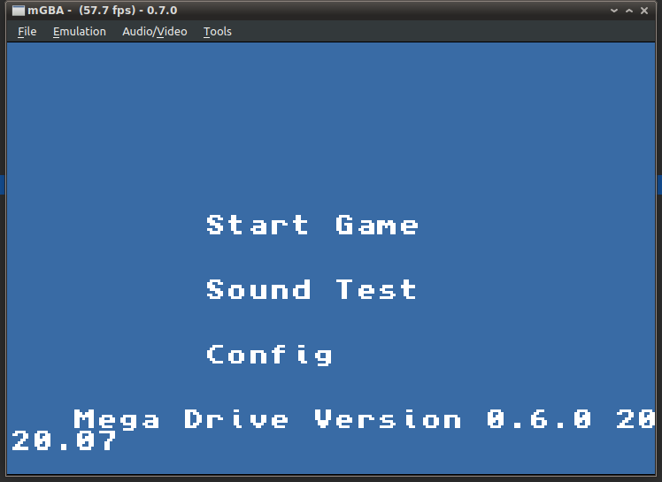

# Cave Story GBA


Work in progress port of [Cave Story MD by andwn](https://github.com/andwn/cave-story-md), for the GBA.

## Download
"Stable" releases can be found in the [Releases](https://github.com/tilderain/cave-story-gba/releases) tab.

## Default Controls

- `A` - Jump, confirm
- `B` - Shoot
- `R` - Fast forward through scripted events
- `L`, `R` - Switch weapon
- `Select` - Toggle extra brightness
- `Start` - Pause / Item Menu

L + R + Select - soft reset

### Cheats
On title menu :
- Stage Select: up, down, left, right, Start. Not Like Sonic.
- Infinite health/ammo: up, up, down, down, left, right, left, right

You can still get crushed, drown and fall out of bounds.
## Compilation
1. Install devkitPro : https://devkitpro.org/wiki/Getting_Started .
2. Go into devkitPro shell and do `pacman -S gba-dev base-devel gcc python`
3. Clone & `make -j8; `
## License
Various, details [here](doc/LICENSE.md)
## Thanks
- andwn: Took on the insane task of porting this game to a 1988 console, and so without, this project would not exist.
- gbadev discord: Moral support
- Pixel-Online discord: "Moral" "support"
- Řrřola: Org2XM
- Livvy94: Cave Story SNES Soundtrack
- Wirelex.exe: Pixel logo
- goombobros: Playtesting
- Ravenworks
- Pixel

Cave Story MD thanks:

```
I did not know how to sort this list, so I did it alphabetically.

- andwhyisit: A whole lot of testing. Automated builds.
- DavisOlivier: Helped with a few music tracks.
- Sik: Mega Drive tech support. Made the font used in-game.
- Other people I probably forgot
```