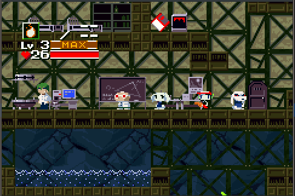

# Cave Story GBA

Proof of concept port of Cave Story MD by andwn, to the GBA. You can get ingame, shoot the enemies and listen to some of the audio.
## Compilation
1. Setup [marsdev](https://github.com/andwn/marsdev) and `python`
  - Marsdev targets: `m68k-toolchain z80-tools sik-tools`
2. Get the gba-dev packages from devkitPro.
3. Clone & `make`
## License
Various, details [here](doc/LICENSE.md)
